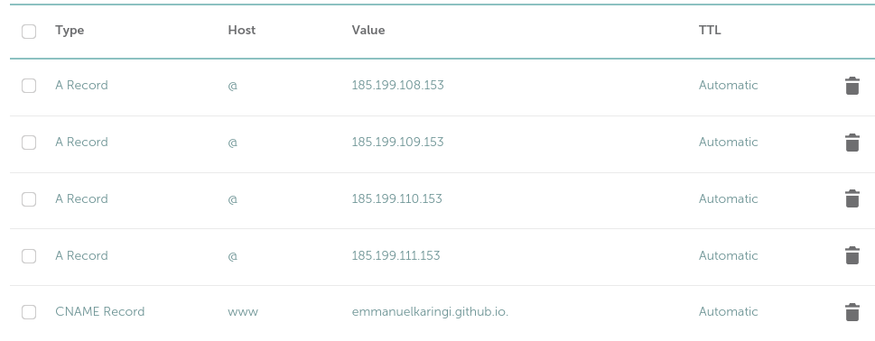

# GitHub Pages Deployment
This project demonstrates a simple GitHub Actions workflow to automatically deploy a static website to GitHub Pages.

## Features
- Automatic deployment of `index.html` to GitHub Pages
- Deployment triggered only when `index.html` is changed
- Continuous Integration and Continuous Deployment (CI/CD) using GitHub Actions

## How it works
1. The repository contains a simple `index.html` file.
2. A GitHub Actions workflow is defined in `.github/workflows/deploy.yml`.
3. When changes are pushed to the main branch and `index.html` is modified, the workflow is triggered.
4. The workflow builds and deploys the website to GitHub Pages.
5. The deployed website is accessible at [https://learningxyz.xyz](https://learningxyz.xyz).

## Setup
1. Fork or clone this repository.
    ```sh
    git clone git@github.com:emmanuelkaringi/Devops-Projects.git
    ```
2. Create the `gh-pages` branch manually. Otherwise, the github actions will throw an error.
3. Allow read and write permissions under Settings > Actions > General > Workflow permissions.

    
4. Make changes to the `index.html` file and push them to the main branch.
5. The GitHub Actions workflow will automatically deploy your changes to GitHub Pages.

**Feel free to modify the `index.html` file to customize the website!**

## Adding a Custom Domain
To add a custom domain to your GitHub Pages site, follow these steps:

1. Purchase a domain name and configure your DNS settings with your domain registrar (I used [Namecheap](https://www.namecheap.com/)):
    - For an apex domain (example.com), create A records pointing to GitHub's IP addresses. Use this [guide](https://docs.github.com/en/pages/configuring-a-custom-domain-for-your-github-pages-site/managing-a-custom-domain-for-your-github-pages-site#configuring-an-apex-domain).
    - For a subdomain (www.example.com), create a CNAME record pointing to your GitHub Pages URL.

    

2. Go to your repository settings and navigate to the "Pages" section. Under "Custom domain", enter your domain name and click "Save".

    

3. Add a CNAME file to your repository with your custom domain (GitHub can add it automatically sometimes).

    `echo "www.yourdomain.com" > CNAME`

4. Wait for DNS changes to propagate (this can take up to 24 hours).
5. Ensure HTTPS is enabled for your custom domain in the repository settings.

    

**After completing these steps, your GitHub Pages site should be accessible via your custom domain with HTTPS enabled.**